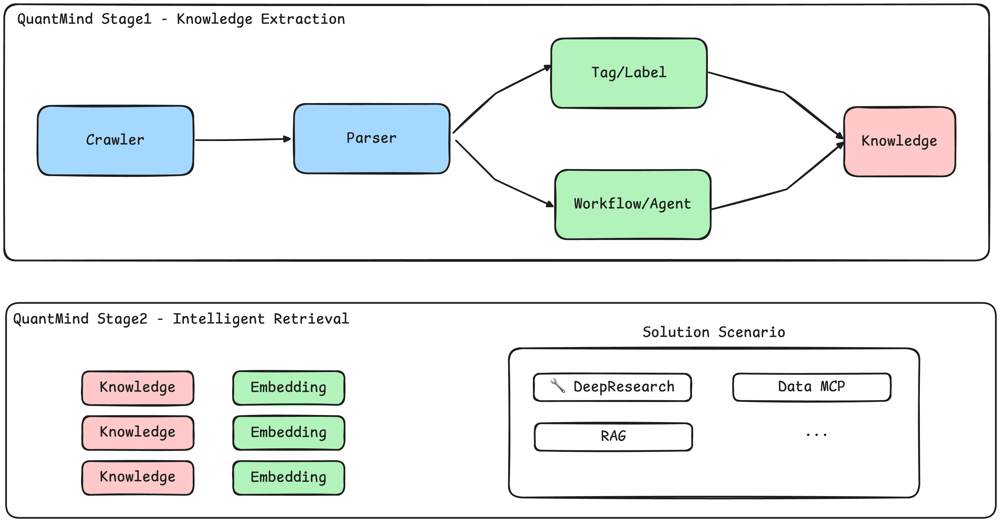

<p align="center">
<b>From Knowledge to Alpha</b><br>

<p align="center">
  
</p>


<!-- 使用 asset/ 下的 svg -->

<h1 align="center">
  
</h1>

<p align="center">
  <b>Transform Financial Knowledge into Actionable Intelligence</b>
</p>
<p align="center">
  <a href="https://github.com/LLMQuant/quant-scholar/blob/main/LICENSE">
    
  </a>
  <a href="https://github.com/LLMQuant/quant-scholar/actions">
    
  </a>
  <a href="https://python.org">
    
  </a>
</p>
<p align="center">
  <a href="#-why-quantmind">Why QuantMind</a> •
  <a href="#system-architecture">Architecture</a> •
  <a href="#-quick-start">Quick Start</a> •
  <a href="#the-vision-an-intelligent-research-agent">Vision</a> •
  <a href="#-contributing">Contributing</a>
</p>


---

**QuantMind** is an intelligent knowledge extraction and retrieval framework for quantitative finance. It transforms unstructured financial content—papers, news, blogs, reports—into a queryable knowledge graph, enabling AI-powered research at scale.

### ✨ Why QuantMind?

The financial research landscape is overwhelming. Every day, hundreds of papers, articles, and reports are published. **QuantMind** solves this by:

- 🔍 **Extracting** structured knowledge from any source (PDFs, web pages, APIs)
- 🧠 **Understanding** content with domain-specific LLMs fine-tuned for finance
- 💾 **Storing** information in a semantic knowledge graph
- 🚀 **Retrieving** insights through natural language queries

---

### System Architecture



QuantMind is built on a decoupled, two-stage architecture. This design separates the concerns of data ingestion from intelligent retrieval, ensuring both robustness and flexibility.

#### **Stage 1: Knowledge Extraction**

This layer is responsible for collecting, parsing, and structuring raw information into standardized knowledge units.

```
Source APIs (arXiv, News, Blogs) → Intelligent Parser → Workflow/Agent → Structured Knowledge Base
```

- **Crawler**: Connects to various sources (academic APIs, news feeds, financial blogs) to pull content
- **Parser**: Extracts text, tables, and figures from PDFs, HTML, and other formats
- **Tag/Label**: Automatically categorizes content into research areas and topics
- **Workflow/Agent**: Orchestrates the extraction pipeline with quality control and deduplication

#### **Stage 2: Intelligent Retrieval**

This layer transforms structured knowledge into actionable insights through various retrieval mechanisms.

```
Knowledge Base → Embeddings → Solution Scenarios (DeepResearch, RAG, Data MCP, ...)
```

- **Embedding Generation**: Converts knowledge units into high-dimensional vectors for semantic search

- Solution Scenarios: Multiple retrieval patterns including:

  - **DeepResearch**: Complex multi-hop reasoning across documents
  - **RAG**: Retrieval-augmented generation for Q&A
  - **Data MCP**: Structured data access protocols
  - Custom retrieval patterns based on use case

---

### 🚀 Quick Start

We use [uv](https://github.com/astral-sh/uv) for fast and reliable Python package management.

**Prerequisites:**

*   Python 3.8+
*   Git

**Installation & Execution:**

1. **Install uv (if not already installed):**

   ```bash
   # On macOS and Linux
   curl -LsSf https://astral.sh/uv/install.sh | sh

   # On Windows
   powershell -c "irm https://astral.sh/uv/install.ps1 | iex"

   # Or using pip
   pip install uv
   ```

2. **Clone the repository:**

   ```bash
   git clone https://github.com/LLMQuant/quant-scholar.git
   cd quant-scholar
   ```

3. **Create and activate virtual environment with uv:**

   ```bash
   # Create a virtual environment
   uv venv

   # Activate it
   # On macOS/Linux:
   source .venv/bin/activate

   # On Windows:
   .venv\Scripts\activate
   ```

4. **Install dependencies:**

   ```bash
   uv pip install -r requirements.txt
   ```

5. **Customize the configuration (optional):**

   ```bash
   # Edit the search keywords and output paths in config.yaml
   ```

6. **Run the pipeline:**

   ```bash
   # Fetch the latest papers and update all output files
   python quant_scholar.py

   # Run only the link validation check
   python quant_scholar.py --update_paper_links
   ```

------

### The Vision: An Intelligent Research Agent

While the current system excels at automated paper collection, QuantMind is designed with a larger vision: to become a comprehensive intelligence layer for all financial knowledge. We're building a system that understands the interconnections between academic research, market news, analyst reports, and social sentiment—creating a unified knowledge graph that powers better financial decisions.

The foundation we're building today—starting with papers—will expand to encompass the entire financial information ecosystem.

**Conceptual Example:**

```python
# The future we are building towards
from quantmind import KnowledgeBase, MemoryBank
from quantmind.agents import PaperReader, NewsMonitor
from quantmind.brain import understand, memorize, recall

# Initialize the knowledge base
kb = KnowledgeBase()
kb.ingest(source="arxiv", topic="portfolio optimization")

# Query for high-level insights
insights = kb.query("latest trends in risk parity strategies")
```

This future state represents our commitment to moving beyond simple data aggregation and toward genuine machine intelligence in the financial domain.

------

### 🤝 Contributing

We welcome contributions of all forms, from bug reports to feature development. If you're interested in helping build the future of financial research, please review our contribution guidelines.

1. **Fork** the repository.
2. **Create a new branch** (`git checkout -b feature/my-new-feature`).
3. **Commit your changes** (`git commit -am 'Add some feature'`).
4. **Push to the branch** (`git push origin feature/my-new-feature`).
5. **Create a new Pull Request**.

Please open an issue in the [GitHub Issues](https://github.com/LLMQuant/quant-mind/issues) tab to discuss any significant changes beforehand.

### License

This project is licensed under the MIT License - see the [LICENSE](https://claude.ai/chat/LICENSE) file for details.

### Acknowledgements

- **arXiv** for providing open access to a world of research.
- The **open-source community** for the tools and libraries that make this project possible.

------


<p align="center"> <b>From Knowledge to Alpha</b><br> Made with ❤️ by <a href="https://github.com/LLMQuant">LLMQuant</a> </p>
